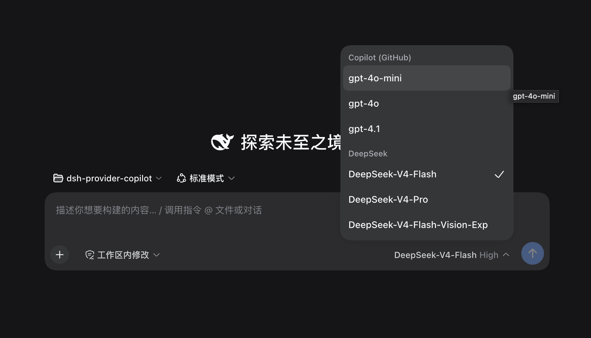
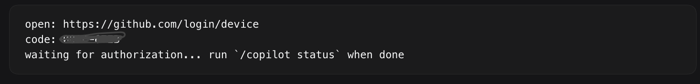

# dsh-provider-copilot

Bridge a **GitHub Copilot subscription** into **DeepSeek Harness (dsh)** as a plain LLM provider.

---

## Scope

- ✅ Chat completions (streaming)
- ✅ Model listing (whitelist ∩ remote)
- ✅ Reasoning-stream passthrough (`delta.reasoning_content` → `reasoning` chunk)
- ✅ `/copilot login | logout | status` commands
- ✅ JSONL observability with strict field allowlist
- ❌ Tool / function calling (explicitly out of scope)
- ❌ Copilot CLI runtime / FFI (not used)

## Architecture

The package is a dsh **plugin bundle**: a cordis object plugin
(`name`/`inject`/`apply`) whose `apply(ctx)` registers a provider route on
the harness LLM service. dsh discovers the model group purely from that
registration — no dsh source changes are needed.

```
┌────────────────────────────────────────────────────────────────────┐
│                    dsh (host, any profile)                          │
│  cordis loader ── apply(ctx, config)                               │
│    └─ ctx.llm.registerAdapter(["copilot"], CopilotAdapter)         │
└────────────────┬───────────────────────────────────────────────────┘
                 │
                 ▼
┌────────────────────────────┐   ┌────────────────────────────────┐
│     CopilotAdapter        │──▶│    CopilotClient (HTTP)        │
│  • dsh StreamChunk emit   │   │  • layered timeouts             │
│  • no tools ever          │   │  • SSE parser                   │
│  • whitelist (+ ∩/models) │   │  • 429 retry once                │
│  • alias collapse         │   │  • never hardcodes base URL      │
└────────────┬───────────────┘   └────────────────┬───────────────┘
             │                                    │
             ▼                                    ▼
┌────────────────────────────┐   ┌────────────────────────────────┐
│    JsonlLogger + Metrics   │   │    AuthManager                 │
│  • ring buffer for status  │   │  • Device Flow state machine   │
│  • JSONL 0600/0700 daily   │   │  • token exchange + cache      │
│  • strict field allowlist  │   │  • blocking + bg refresh, dedup│
└────────────────────────────┘   └────────────────────────────────┘
```

Inside dsh the streamed response uses the harness chunk protocol
(`block-start` / `text-delta` / `reasoning-delta` / `block-end` / `usage` /
`finish`); `reasoning` deltas render in dsh's collapsible "thinking" row.
The adapter is plain chat: it never forwards `tools`, and dsh handles that
fine — an assistant reply without tool calls ends the turn normally.

## Sequence: first call after login

```
user       dsh         CopilotAdapter   CopilotClient   AuthManager   github
 │  /copilot login     │                │              │             │
 │────────────────────▶│                │              │             │
 │  (returns code+URL; device flow continues in the background)       │
 │◀── code: ABCD-1234 ─│                │              │             │
 │  authorize in browser                                 │◀── ghu_* ─│
 │                    │                │              │──── exchange│
 │                    │                │              │◀ Copilot bearer + endpoints
 │  first prompt      │                │              │             │
 │──────────────────▶│  stream(req)   │              │             │
 │                    │───────────────▶│ getBearer()  │             │
 │                    │                │─────────────▶│ cached      │
 │                    │                │◀── bearer ───│             │
 │                    │                │──── POST /chat/completions (SSE) ─▶
 │                    │◀── StreamChunks│◀── parsed chunks ────────────────
 │◀── rendered ───────│                │              │             │
```

## Non-public API notice

This project uses `api.github.com/copilot_internal/v2/token` to exchange a
GitHub OAuth token for a Copilot bearer token. That endpoint is a
**non-public, unstable interface**; GitHub may change or revoke it at any
time. Use in production at your own risk.

Additional compliance notes:

- User-Agent must start with `GitHubCopilot*`; anti-scraping otherwise returns
  a 403 that looks like an auth error.
- The plugin ships the official VSCode Copilot Chat OAuth `client_id`
  (`Iv1.b507a08c87ecfe98`). Tokens are minted under your GitHub account and
  used only against the Copilot subscription you own.
- The Device Flow scope is `read:user` only. No repository / gist / issue
  scopes are requested.
- dsh requires app attribution on every provider HTTP request; the Copilot
  endpoints additionally require the `GitHubCopilot*` User-Agent. Verify the
  header combination you ship against a live request before release.

## Install

The package is a dsh **bundle**: its manifest declares `dsh.bundle` and it
ships a `cordis.patch.yml` that inserts the plugin row. Installing it with
`dsh plugin` therefore adds it to the profile's bundle layers:

```bash
# install from GitHub:
dsh plugin --profile <your-profile> add github:youngrock-labs/dsh-provider-copilot
# install from a local checkout:
dsh plugin --profile <your-profile> add /absolute/path/to/dsh-provider-copilot
```

Restart dsh (or reload the profile) to activate the plugin. It mounts
dormant: the `copilot` provider group is advertised immediately — it shows
up in the model picker without any sign-in — and the first request without
credentials reports `MISSING_CREDENTIAL` with pointers to `/copilot login`
and the environment variables below.



Development without packaging: add the row to the profile patch manually

```yaml
- id: llm-copilot
  name: './path/to/dsh-provider-copilot/src/plugin/plugin.ts'
```

## Usage — inside dsh

The `/copilot login | logout | status` commands are real dsh commands,
registered when the host command service is present (dsh Web resolves `/`
lines against them):

```
/copilot login    # Device Flow: prints the verification URL + code and
                  #   finishes authorizing in the background
/copilot status   # source, expiry, model count, p50/p95 latency
/copilot logout   # wipes cache + memory + metrics
```

`/copilot login` returns the GitHub verification URL and the one-time code
to enter there; authorization continues in the background once you approve
it in the browser:



In dsh's model picker (the group is visible from install, see above),
select a model inside the **Copilot (GitHub)** group. Selecting a model
makes it the default for new sessions; each session keeps its own recorded
selection. Pick again any time to switch models. Sending a request requires
a credential: set `COPILOT_TOKEN` / `COPILOT_GITHUB_TOKEN`, or run
`/copilot login` above. Once signed in, the advertised list is intersected
with the upstream `/models` catalog.

## Usage — programmatic (BYOK)

```ts
import { AuthManager, CopilotClient, CopilotProvider } from "dsh-provider-copilot";

const auth = new AuthManager({
    byok: { kind: "github", token: process.env.MY_GITHUB_TOKEN! },
});
const client = new CopilotClient({
    getBearer: async () => {
        const s = await auth.getSession();
        return { token: s.token, endpoints: { api: s.endpoints.api } };
    },
});
const provider = new CopilotProvider({ client });

for await (const chunk of provider.stream({
    model: "gpt-4o-mini",
    messages: [{ role: "user", content: "hi" }],
})) {
    if (chunk.type === "text") process.stdout.write(chunk.text);
}
```

### Token source priority

`AuthManager` resolves credentials in this order:

1. `byok` constructor option — a `{ kind: "bearer" | "github", token }`.
2. `env COPILOT_TOKEN` — a raw Copilot bearer; skips exchange.
3. `env COPILOT_GITHUB_TOKEN` — a GitHub token; drives exchange.
4. On-disk OAuth cache from a previous `/copilot login`.
5. `~/.config/gh/hosts.yml` (opt-in: `DSH_COPILOT_ALLOW_GH_HOSTS=1`).
6. `GH_TOKEN` / `GITHUB_TOKEN` (opt-in: `DSH_COPILOT_ALLOW_ENV_GH=1`).

Sources 5–6 are opt-in because "any GitHub token" leaking into a
Copilot-specific credential surface is easy to do by accident.

## Configuration

| Env var                       | Effect                                                     |
| ----------------------------- | ---------------------------------------------------------- |
| `COPILOT_TOKEN`               | Skip exchange; use as Copilot bearer directly.             |
| `COPILOT_GITHUB_TOKEN`        | GitHub token to exchange for a Copilot bearer.             |
| `DSH_COPILOT_ALLOW_GH_HOSTS`  | `1` enables reading `gh` `hosts.yml` as fallback.          |
| `DSH_COPILOT_ALLOW_ENV_GH`    | `1` enables reading `GH_TOKEN` / `GITHUB_TOKEN` fallback.  |
| `DSH_COPILOT_NO_LOG`          | `1` disables JSONL log writes (no directory / files).      |
| `XDG_CONFIG_HOME`             | Standard XDG override for cache & log location.            |

## Observability

- **In-memory ring buffer:** last 10 successful calls used for
  `/copilot status` p50/p95.
- **JSONL log:** `~/.config/dsh/copilot/log/copilot-YYYY-MM-DD.jsonl`.
  Fields are a hard-coded allowlist:
  `ts, requestId, event, model, latencyMs, promptTokens, completionTokens,
  totalTokens, errorCode, source, sku`.
  Any attempt to log outside that set is rejected at runtime.
- **Retention:** 7 days by default; pruning is lazy on the first write
  of a new UTC day; failures are silent.
- **Perms:** dir 0700, files 0600, matching auth cache.

## Troubleshooting

| Symptom                                        | Likely cause / fix                                                                                    |
| ---------------------------------------------- | ----------------------------------------------------------------------------------------------------- |
| `403 scraping` from `api.github.com`           | Non-Copilot UA. Do not override the built-in headers.                                                 |
| `token_exchange_forbidden` (403)               | Account has no Copilot entitlement (individual not subscribed, org/enterprise seat unassigned).       |
| `token_exchange_unauthorized` (401)            | Stale GitHub token. `/copilot logout` then `/copilot login`.                                          |
| `no_token_source`                              | Nothing to authenticate with. Set `COPILOT_TOKEN` / `COPILOT_GITHUB_TOKEN` or run `/copilot login`.   |
| `http_connect_timeout`                         | Network / DNS. Check corporate proxy; tune `timeouts.connectMs` if needed.                            |
| `http_first_byte_timeout`                      | Upstream slow to respond. Tune `timeouts.firstByteMs`.                                                |
| `http_idle_timeout`                            | Stream stalled mid-flight. Tune `timeouts.idleMs`.                                                    |
| Model missing from `/copilot status` count     | Not in the whitelist ∩ upstream. Pass a custom `whitelist` to `CopilotProvider` if you know the id.   |
| `unknown subcommand: X`                        | Only `login`, `logout`, `status` are supported.                                                       |

## Development

```bash
npm install
npm test           # 160+ tests across auth / client / provider / plugin / commands / observability / e2e
npm run typecheck
npm run lint
```

New dsh-facing code lives under `src/plugin/` (adapter, chunk translation,
error taxonomy, plugin entry, dsh command handler); the legacy BYOK
`CopilotProvider` API is unchanged.

Feasibility PoC (Device Flow → models → stream):

```bash
npm run poc -- device
export GH_OAUTH_TOKEN=ghu_xxx
npm run poc
```

Coverage is opt-in:

```bash
npm i -D @vitest/coverage-v8@2.1.8   # match your vitest version
npx vitest run --coverage
```

## License

MIT — see `LICENSE`.
